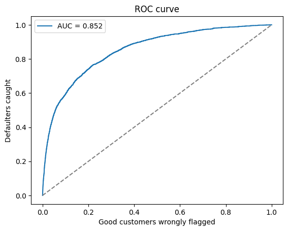

# Credit Default Risk Model and Approval Strategy

Predicting which borrowers will seriously default within 2 years, and using those predictions to choose the most profitable approval policy.

## Data
Give Me Some Credit (Kaggle): 150,000 borrowers, 10 features, 6.7% default rate.

## Approach
1. **Exploration:** found default falls with age (12% under 30, 2% over 70) and jumps with past delinquency (5% with no 90-day lates, 34% with one).
2. **Cleaning:** removed invalid ages, flagged error codes (96/98) and missing income instead of deleting rows, capped outliers at the 99th percentile, log-transformed skewed variables.
3. **Model:** logistic regression on a stratified 70/30 split with standardized features.
4. **Evaluation:** AUC, Gini and KS on holdout data.
5. **Strategy:** simulated approval cutoffs and profit under stated assumptions.

## Results
| Metric | Train | Test |
|---|---|---|
| AUC | 0.850 | 0.852 |
| Gini | | 0.705 |
| KS | | 0.545 |

Train and test AUC match closely, so the model generalizes well.

**Top risk drivers:** credit utilization, past 30/60/90-day delinquencies. Age lowers risk.

## Approval Strategy
Assumptions: Rs 5,000 profit per good customer, Rs 50,000 loss per default.

| Approval rate | Bad rate | Defaulters rejected | Profit (Rs cr) |
|---|---|---|---|
| 70% | 1.97% | 79% | 12.33 |
| **80%** | **2.53%** | **70%** | **13.00** |
| 90% | 3.45% | 54% | 12.57 |
| 100% | 6.68% | 0% | 5.96 |

**Recommendation:** approve the safest 80%. Profit more than doubles versus approving everyone, and the bad rate falls 62%. An 85% cutoff gives near-equal profit if growth is a priority.

## Limitations and Next Steps
- DebtRatio is unreliable when income is missing, which made its coefficient counterintuitive.
- Next: Weight of Evidence binning for a points-based scorecard, and a gradient boosting comparison.
